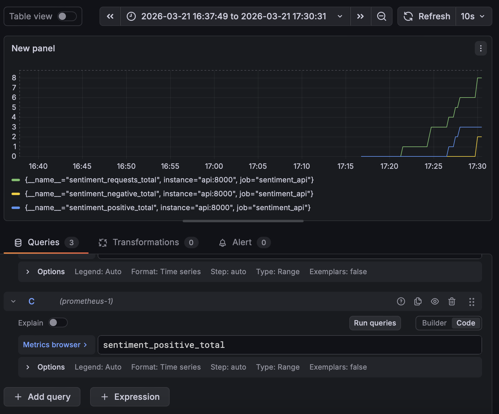
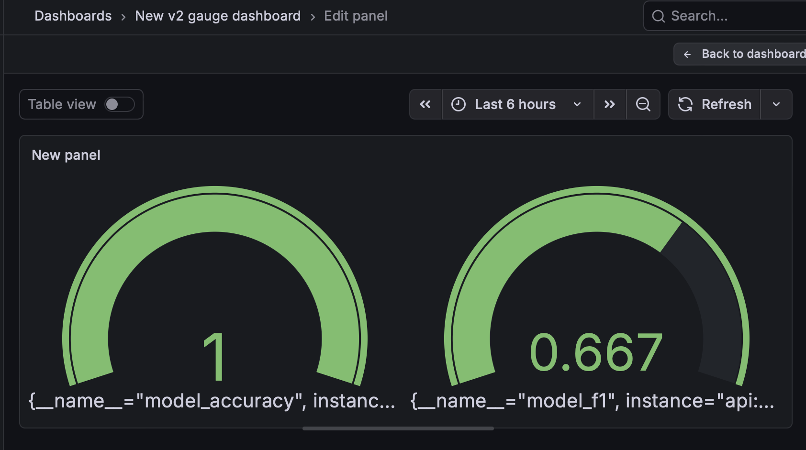

# MLOps sentiment - README file
Project details
- Phase 1: Implementation of the Sentiment Analysis Model
  - Model: Use a pre-trained model for sentiment analysis capable of classifying social media texts into positive, neutral, or negative sentiment. Use this model: https://huggingface.co/cardiffnlp/twitter-roberta-base-sentiment-latest
  - Dataset: Use public datasets containing texts and their respective sentiment labels.
- Phase 2: Creation of the CI/CD Pipeline
  - CI/CD Pipeline: Develop an automated pipeline for model training, integration testing, and deployment of the application on Hugging Face.
- Phase 3: Deployment and Continuous Monitoring
  - Deployment on Hugging Face (optional): Implement the sentiment analysis model, including data and application, on Hugging Face to facilitate integration and scalability.
  - Monitoring System: Set up a monitoring system to continuously evaluate the model’s performance and the detected sentiment.

# PREVIEW:
## Structure
```bash
MLops_project/
├── .github/workflows/
│   └── CI_integration.yml    # Continuous integration pipeline
├── deploy/
│   ├── deploy_hf.py    # File to deploy model into hugging face
├── model_app/
│   ├── model_inference.py    # Inference and relative apis
│   └── model_training.py     # Model training
│   └── model_utility.py      # Utility functions for model_app
├── monitoring/
│   ├── metrics.py            # Base structure of metrics
│   └── prometheus.yml        # Prometheus config
├── tests/
│   └── test_integration.py # Integration tests
│   └── test_model_training.py # Training tests
├── docker-compose.yml        # Docker compose config
├── Dockerfile                # Docker image config
└── requirements.txt
└── pytest.ini                # File needed by pytest
```

## extra folders, created by the app:
```bash
├── my_latest_model           # It contains the latest created model
├── my_model_versions         # It contains the versioning of each created model (the latest one '/model_v_{newer_version}' it is the same one inside 'my_latest_model' )
```


## Use suggestions:
- Tested on a macOS (UNIX).
- Python version 3.12 required.


# GENERAL APP FLOW:
- When the app starts (using docker), in ```model_inference.py``` tha app checks for existing models (if never used before or deleted every previous model, it will be used the default one and needed folders will be created) and then uvicorn runs the inference api (```/predict```).
- At this point, predictions and evaluation can be made calling ```/predict```.
- When the project is updated through a commit on github's 'main' branch, the pipeline file ```CI_CD.yml``` trains the model, runs integration tests (```test_integration.py```) and, if these steps ends with a success, it (optionally) deploys the model on HuggingFace.
- While the app is running, the connection with Grafana made through Prometheus (pages reachable through the 'port' section in your terminal) allows to monitor visually the performance of the model and the sentiment (more at [grafana instructions](#grafana-dashboard)).


# Technical choices:
- In order to save resources (for example on github codespaces) these values have been set as small as reasonably possible:
  - ```raw_datasets = load_dataset(DATASET, "sentiment", split={"train": "train[:100]", "test": "test[:100]", "validation": "validation[:100]"})```; increase the values to have a bigger dataset.
  - same reason for ```per_device_train_batch_size=1,``` and ```per_device_eval_batch_size=1,``` inside ```TraningArguments``` in ```model_app/model_training.py```; ideally bring it at least up to value 8 or higher if possible (32).


# HOW TO USE IT:
## How to run it:
- Create an environment (not mandatory but strongly suggested) and activate it.
- Run ```docker compose up --build -d```, what it does is:
  - ```docker compose up``` reads the docker-compose.yml and starts all the services
  - ```--build```builds a new image 
  - (optional) ```-d``` keeps the container in background (to not have the terminal saturated by logs).
NOTE: to enable the deploy on Hugging Face go to [deploy instructions](#deploy-on-hugging-face)


## Useful commands:
- Create an environment:
```python3.12 -m venv <name_your_venv>```
and activate it:
```source <name_your_venv>/bin/activate```
to deactivate:
```deactivate```

- Running the app:
```docker compose up --build -d```
everything will start properly.

- In case of any issue with docker run:
```docker compose logs <service_name>```
to debug the service

- In case of space limitations (example github: codespaces), run these two commands to clean docker:
WARNING: this can delete data, use it carefully.
```docker system prune -af && docker builder prune -af```

## Run Tests:
Just run ```pytest``` in the terminal to execute all the tests inside tests folder.

## Deploy on Hugging Face:
Deploy on Hugging Face is optional, it will be executed only if there a specific github variable (RUN_DEPLOY) setted as 'true'. To do so go to GitHub repo > Settings > Variables > Actions and create the variable ```RUN_DEPLOY = true```.

### Grafana dashboard:
Go on ports (they MUST be public) > open port 3000 in your browser (default credentials are user:admin pssw:admin), setup a new connection (http://prometheus:9090) and link it to a new dashboard.
- example of queries that can be called on Grafana: sentiment_positive_total, sentiment_negative_total, sentiment_requests_total, model_accuracy, model_f1, etc...
- visual example:
 classic
 gauge

### Check Prometheus status
Go on ports > open port 9090 > 'status' > 'target health'

### Check FastAPI
Go to https://{codespace_name_or_localhost}-8000.app.github.dev/docs to check api.

### if you want to test it using a tool like Postman, this CURL can be used:
curl -X POST \
"https://{codespace_name_or_localhost}-8000.app.github.dev/predict" \
-H "Content-Type: application/json" \
-d '{
  "text": "Ciao questo è un test fantastico",
  "label": "positive"
}'
